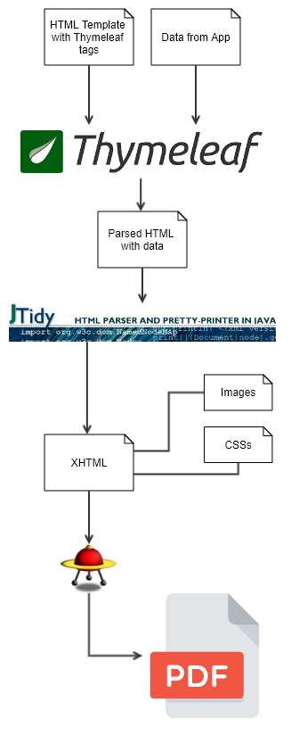

# CalculaOras 

É um projeto para gerar uma folha de justificativa de ponto em PDF, além disso, o próprio projeto já calcula horas diarias (aleatórias) com base na carga horaria informada.

Utiliza o __Flying Saucer__, __IText__ e __JTidy__ para a conversão do template em HTML com __Thymeleaf__ para geração final do PDF.

## Exemplo:

